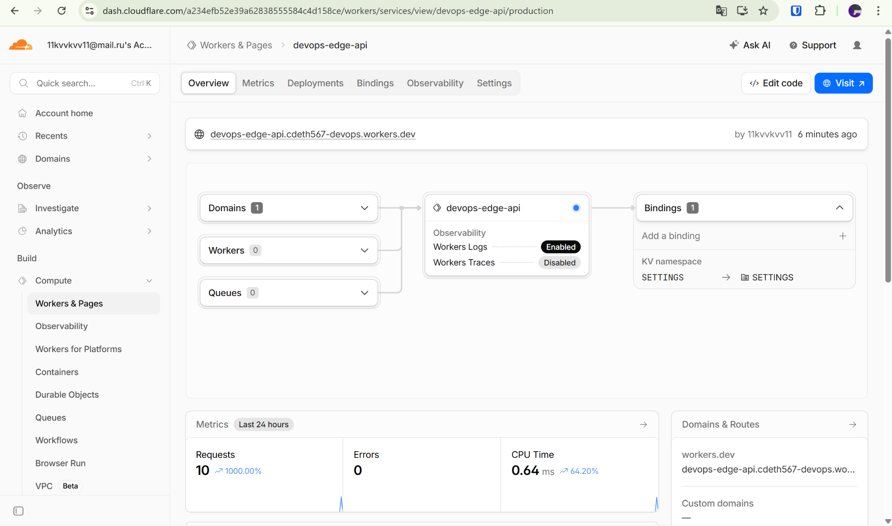
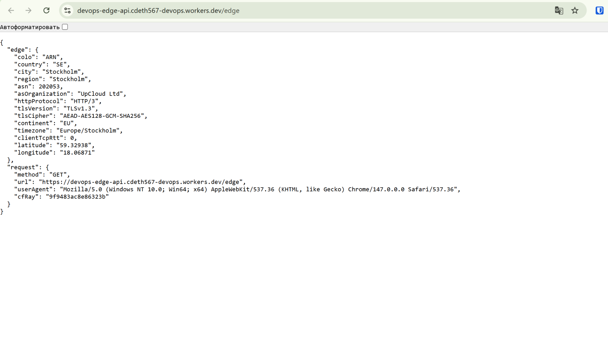
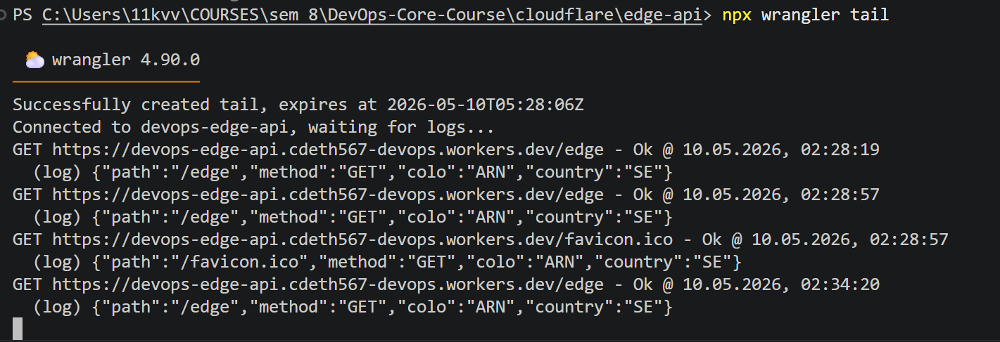
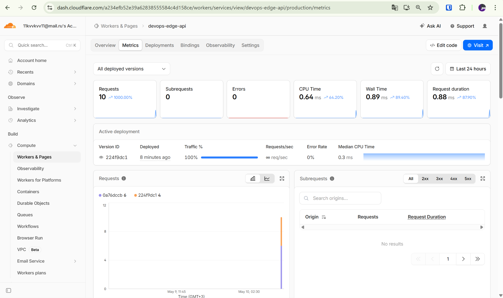
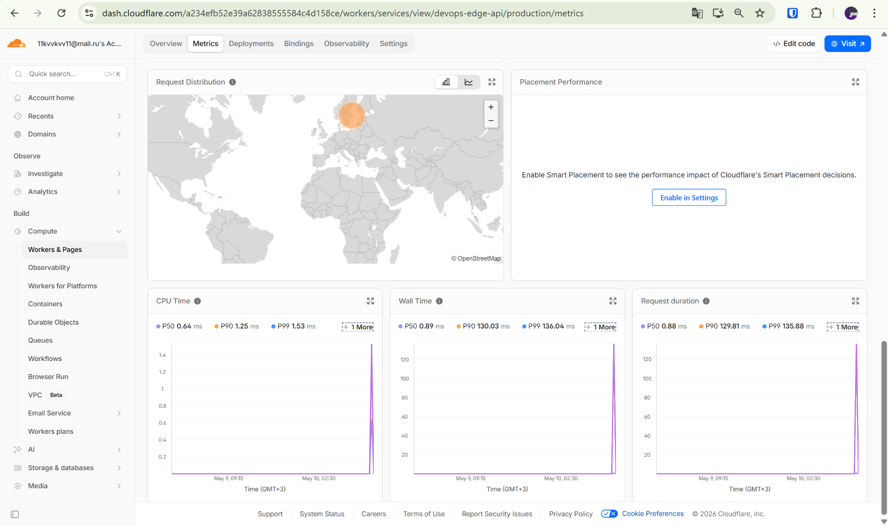

# Cloudflare Workers Edge Deployment

## 1. Deployment Summary

### Worker URL
- Public URL: `https://devops-edge-api.cdeth567-devops.workers.dev`

### Main Routes
- `/` — general application information
- `/health` — health check endpoint
- `/edge` — Cloudflare edge metadata for the current request
- `/config` — runtime configuration response
- `/secrets` — secret-based response through Worker bindings
- `/counter` — persisted visit counter backed by Workers KV
- `/kv/<key>` — KV read/write access pattern

### Configuration Used
- Runtime: Cloudflare Workers
- Language: TypeScript
- Deployment tool: Wrangler CLI
- Public routing: `workers.dev`
- KV binding: `SETTINGS`
- Plaintext environment variables in `wrangler.jsonc`:
  - `APP_NAME=devops-edge-api`
  - `APP_VERSION=1.0.1`
  - `COURSE_NAME=DevOps Core Course`
  - `ENVIRONMENT=production`
- Secrets: configured through Wrangler and accessed through `env` at runtime

---

## 2. Evidence

### Cloudflare Dashboard


### Public `/edge` Response


### Worker Logs with `wrangler tail`


### Worker Metrics


### Deployment History


---

## 3. Edge Behavior

The `/edge` endpoint returns metadata from Cloudflare's request context. In the deployed response, the Worker returned real edge execution data including:
- `colo: ARN`
- `country: SE`
- `city: Stockholm`
- `region: Stockholm`
- `asn: 202053`
- `httpProtocol: HTTP/3`
- `tlsVersion: TLSv1.3`
- `cfRay` in the request metadata

This confirms that the request was processed through Cloudflare's global edge network and that the Worker can access edge-specific metadata directly from the incoming request.

### Global Distribution Explanation
Cloudflare Workers executes code close to the user on Cloudflare's distributed edge platform. Unlike VM-based or Kubernetes deployments, there is no separate step to deploy the application to specific regions. The platform automatically places execution near the request path and handles distribution for the developer.

### Routing Concepts
- **`workers.dev`** provides a public URL immediately after deployment.
- **Routes** attach a Worker to traffic for an existing Cloudflare-managed zone.
- **Custom Domains** allow the Worker to become the origin for a chosen domain or subdomain.

For this lab, `workers.dev` was sufficient and matched the assignment requirements.

---

## 4. Configuration, Secrets, and Persistence

### Plaintext Variables
Plaintext variables in `wrangler.jsonc` were used for application metadata such as app name, version, course name, and environment. These are suitable for non-sensitive configuration.

Plaintext vars are **not** appropriate for secrets because they are stored in configuration files and may be committed to Git.

### Secrets
Sensitive values were configured as Wrangler secrets and consumed through the Worker `env` object at runtime. Secret values were intentionally not committed to the repository.

### Workers KV Persistence
A KV namespace named `SETTINGS` was created and bound to the Worker. The `/counter` route stores and updates a persistent `visits` key inside Workers KV.

Persistence was verified across deployments:
- Before the second deployment, `/counter` returned `visits: 3`
- After updating the Worker version and deploying again, `/counter` returned `visits: 4`

This shows that state was preserved independently from the code deployment itself.

---

## 5. Observability and Operations

### Logs
A `console.log()` statement was added to the Worker. Logs were observed using:

```bash
npx wrangler tail
```

Example log entry captured during testing:

```text
{"path":"/edge","method":"GET","colo":"ARN","country":"SE"}
```

### Metrics Reviewed
The Cloudflare dashboard metrics page was used to inspect runtime behavior. The main values reviewed were:
- Requests: `10`
- Errors: `0`
- CPU Time: `0.64 ms`
- Wall Time: `0.89 ms`
- Request Duration: `0.88 ms`

These metrics show that the Worker handled requests successfully with no recorded errors and very small execution overhead.

### Deployment History
Deployment history was reviewed both in the dashboard and through:

```bash
npx wrangler deployments list
```

The Worker had multiple saved versions, including the active deployment `224f9dc1` and previous deployments such as `0a76dccb`, `722e7849`, `dfb05e00`, and `6904225f`.

### Rollback
A rollback was **described** rather than executed. If rollback were needed, it could be performed from the Cloudflare dashboard deployment history or with Wrangler using:

```bash
npx wrangler rollback
```

Because the currently deployed Worker was healthy and the public routes worked correctly, a live rollback was not necessary.

---

## 6. Kubernetes vs Cloudflare Workers Comparison

| Aspect | Kubernetes | Cloudflare Workers |
|--------|------------|--------------------|
| Setup complexity | Higher: cluster, manifests, services, storage, ingress, and controllers | Lower: Worker project, Wrangler config, and deploy |
| Deployment speed | Slower due to container build, image push, scheduling, and rollout | Very fast upload-based deployment |
| Global distribution | Requires multi-region architecture and explicit traffic design | Built-in global edge execution |
| Cost (for small apps) | Often higher due to always-on cluster resources | Usually better for small event-driven APIs |
| State / persistence model | PVCs, databases, StatefulSets, external services | KV, Durable Objects, D1, R2, platform bindings |
| Control / flexibility | Very high; supports long-running containers and custom runtimes | More constrained runtime, but simpler operational model |
| Best use case | Complex platforms, background services, containerized workloads | Lightweight APIs, edge logic, request transformation, globally distributed endpoints |

---

## 7. When to Use Each

### Use Kubernetes When
- You need full container control
- You run long-lived services or background workers
- You need complex networking, storage, or sidecar patterns
- You manage several microservices with custom runtime requirements

### Use Cloudflare Workers When
- You need a lightweight HTTP API
- You want very fast deployment and simple public exposure
- You want code to run close to users globally
- Your application is event-driven and does not require a full container host

### Recommendation
For small globally distributed APIs, simple integrations, counters, edge routing logic, or lightweight service endpoints, Cloudflare Workers is the better choice. For complex applications with persistent processes, container dependencies, or advanced orchestration needs, Kubernetes remains the stronger platform.

---

## 8. Reflection

Cloudflare Workers felt easier than Kubernetes in several areas:
- deployment was significantly faster
- public exposure through `workers.dev` was immediate
- edge metadata was available directly through the request context
- observability and deployment history were available from the platform dashboard

At the same time, Workers felt more constrained because it is **not a Docker host**. I could not rely on a full container runtime, background daemons, or the broader orchestration model available in Kubernetes. Instead, the application had to be designed around the Workers execution model and Cloudflare bindings such as vars, secrets, and KV.

The biggest architectural difference was the persistence model. In Kubernetes, persistence is typically attached through volumes or external services. In Workers, persistence is provided through platform-native storage services such as KV, which changes both the implementation style and the operational model.

---

## 9. Useful Commands

```bash
# Verify authentication
npx wrangler whoami

# Run locally
npx wrangler dev

# Deploy publicly
npx wrangler deploy

# Tail production logs
npx wrangler tail

# Show deployment history
npx wrangler deployments list

# Roll back to a previous deployment if needed
npx wrangler rollback

# Public endpoint checks
curl.exe https://devops-edge-api.cdeth567-devops.workers.dev/
curl.exe https://devops-edge-api.cdeth567-devops.workers.dev/health
curl.exe https://devops-edge-api.cdeth567-devops.workers.dev/edge
curl.exe https://devops-edge-api.cdeth567-devops.workers.dev/counter
```
