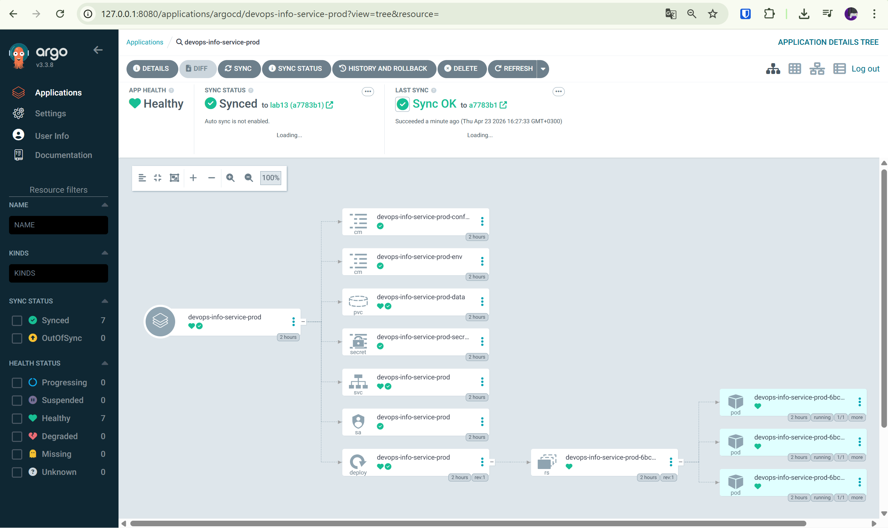
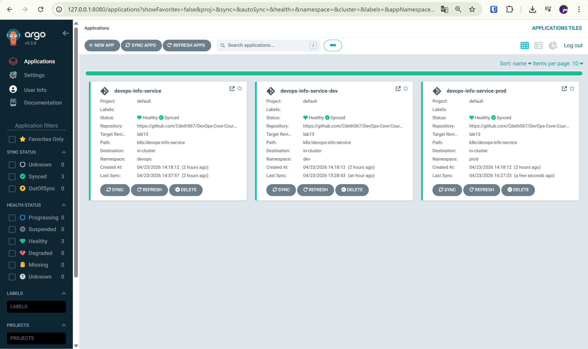
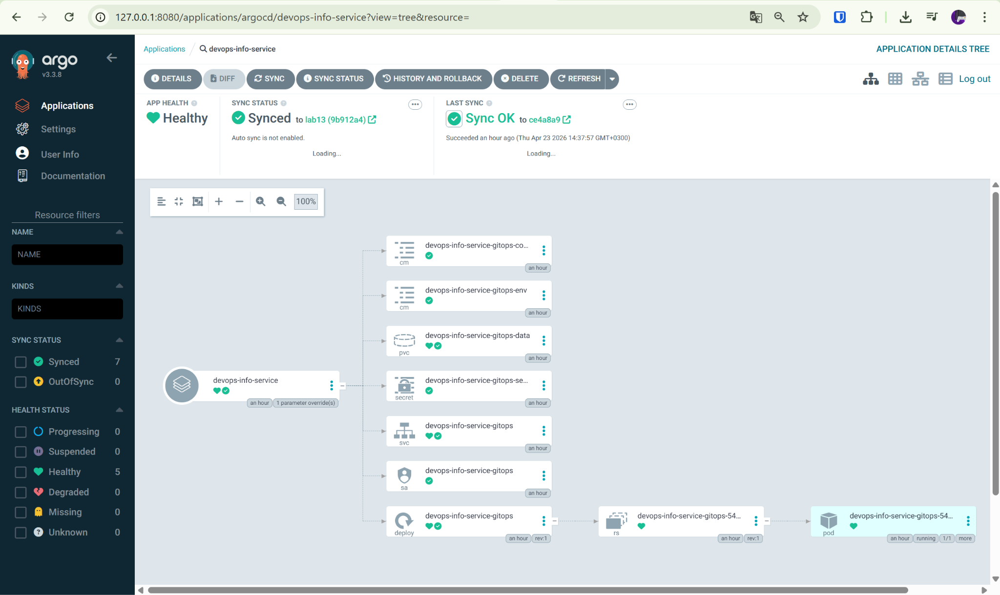
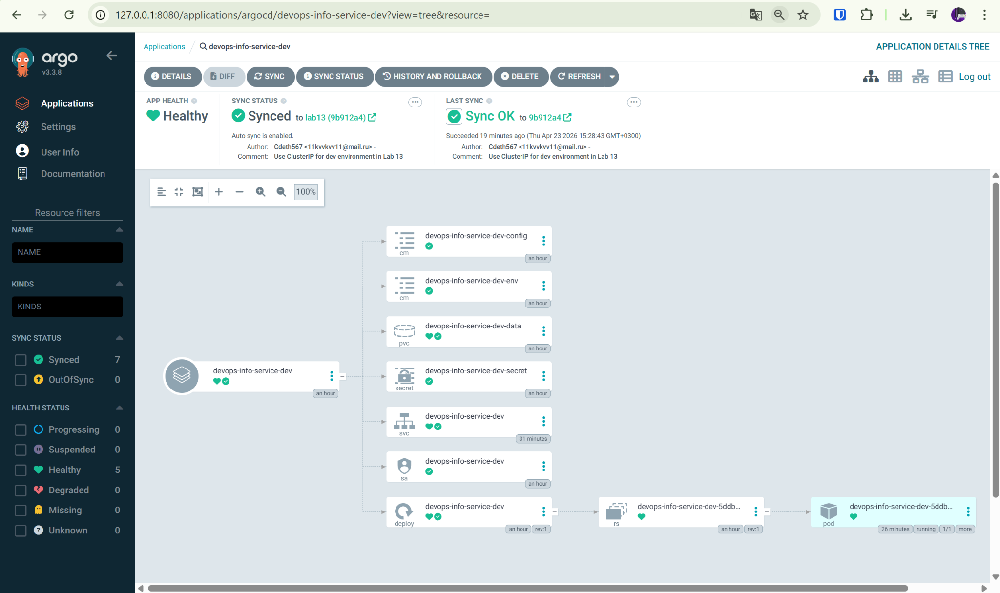

# Lab 13 — GitOps with ArgoCD

## Status

The required technical part of Lab 13 has been completed.

The only optional improvement for a fully polished submission is to insert real ArgoCD UI screenshots into this report if the instructor strictly requires embedded images inside `k8s/ARGOCD.md`.

All mandatory technical requirements from the assignment were completed:
- ArgoCD was installed via Helm
- the UI is accessible
- the CLI was installed and login works
- ArgoCD Application manifests were created
- the single application deployment works
- the `dev` and `prod` environments were deployed
- `dev` uses auto-sync and self-healing
- `prod` remains manual
- self-healing was tested
- pod deletion behavior was tested
- configuration drift was tested

---

## 1. ArgoCD Setup

### Installation

ArgoCD was installed into a dedicated `argocd` namespace via Helm.

Commands used:
```powershell
helm repo add argo https://argoproj.github.io/argo-helm
helm repo update
kubectl create namespace argocd
helm upgrade --install argocd argo/argo-cd `
  --namespace argocd `
  -f .\k8s\argocd\argocd-values.yaml
```

Installation result:
```text
Release "argocd" has been upgraded. Happy Helming!
NAME: argocd
NAMESPACE: argocd
STATUS: deployed
REVISION: 2
DESCRIPTION: Upgrade complete
```

### Readiness Verification

After increasing `repoServer` resources and probe timeouts, all major ArgoCD components were running:

```text
NAME                                                READY   STATUS    RESTARTS   AGE
argocd-application-controller-0                     1/1     Running   0          33m
argocd-applicationset-controller-68856dfdb9-slqp8   1/1     Running   0          33m
argocd-dex-server-8559c4bc8f-kfl28                  1/1     Running   0          33m
argocd-notifications-controller-568ff4879-x2v27     1/1     Running   0          33m
argocd-redis-fcd76bcfb-tzsqp                        1/1     Running   0          33m
argocd-repo-server-86bd59766c-c976c                 1/1     Running   0          59s
argocd-server-68646cfd69-rgx6q                      1/1     Running   0          33m
```

The `argocd-repo-server` endpoint also appeared, confirming that the crash loop issue had been fixed:

```text
NAME                 ENDPOINTS
argocd-repo-server   10.244.0.88:8081
```

### UI Access

The UI was accessed using port-forward:

```powershell
kubectl port-forward svc/argocd-server -n argocd 8080:80
```

Browser URL:
```text
http://127.0.0.1:8080
```

### Initial Admin Password

The initial admin password was retrieved successfully:

```powershell
[System.Text.Encoding]::UTF8.GetString([System.Convert]::FromBase64String((kubectl -n argocd get secret argocd-initial-admin-secret -o jsonpath="{.data.password}")))
```

### CLI Installation and Login

The CLI was downloaded and used for login:

```powershell
Invoke-WebRequest -Uri $url -OutFile .\argocd.exe
.\argocd.exe login 127.0.0.1:8080 --insecure
```

Login result:
```text
'admin:login' logged in successfully
Context '127.0.0.1:8080' updated
```

---

## 2. Application Configuration

### Files Added

The following manifests were added under `k8s/argocd/`:
- `application.yaml`
- `application-dev.yaml`
- `application-prod.yaml`
- `namespaces.yaml`
- `argocd-values.yaml`

### Single Application

`application.yaml` defines a manual single-app deployment in the `devops` namespace:
- repoURL: `https://github.com/Cdeth567/DevOps-Core-Course.git`
- targetRevision: `lab13`
- path: `k8s/devops-info-service`
- valueFiles: `values-dev.yaml`
- destination namespace: `devops`
- syncPolicy: manual

### Multi-Environment Applications

#### Dev
`application-dev.yaml`:
- namespace: `dev`
- values file: `values-dev.yaml`
- automated sync enabled
- `prune: true`
- `selfHeal: true`

#### Prod
`application-prod.yaml`:
- namespace: `prod`
- values file: `values-prod.yaml`
- manual sync
- no automated sync block

### Namespace Separation

Separate namespaces were created for the environments:

```powershell
kubectl apply -f .\k8s\argocd\namespaces.yaml
```

Result:
```text
namespace/dev created
namespace/prod created
```

---

## 3. Deployment via ArgoCD

### Applications Created

Applications were created with:

```powershell
kubectl apply -f .\k8s\argocd\application.yaml
kubectl apply -f .\k8s\argocd\application-dev.yaml
kubectl apply -f .\k8s\argocd\application-prod.yaml
```

### Application List

After fixing `repo-server` and syncing the applications, the statuses were:

```text
NAME                             CLUSTER                         NAMESPACE  PROJECT  STATUS     HEALTH       SYNCPOLICY
argocd/devops-info-service       https://kubernetes.default.svc  devops     default  Synced     Healthy      Manual
argocd/devops-info-service-dev   https://kubernetes.default.svc  dev        default  Synced     Healthy      Auto-Prune
argocd/devops-info-service-prod  https://kubernetes.default.svc  prod       default  Synced     Progressing  Manual
```

At the moment this status was captured, `prod` still showed `Progressing` in ArgoCD, but the deployment itself had already been created successfully, pods were running, and the PVC was bound.

### Single App Sync

Manual sync for the single app:

```powershell
.\argocd.exe app sync devops-info-service
```

Result:
```text
Sync Status: Synced to lab13 (ce4a8a9)
Health Status: Healthy
Phase: Succeeded
Message: successfully synced (no more tasks)
```

Resources created:
- ServiceAccount
- Secret
- file-based ConfigMap
- environment ConfigMap
- PVC
- Service
- Deployment
- pre-install Job
- post-install Job

### Prod Sync

Manual sync for the production app:

```powershell
.\argocd.exe app sync devops-info-service-prod
```

Deployment verification:
```text
NAME                                         READY   STATUS      RESTARTS   AGE
devops-info-service-prod-6bccfb4ff8-dtzfj    1/1     Running     0          18m
devops-info-service-prod-6bccfb4ff8-mqhwf    1/1     Running     0          18m
devops-info-service-prod-6bccfb4ff8-xst9p    1/1     Running     0          18m
devops-info-service-prod-pre-install-sjhkx   0/1     Completed   0          19m
```

Production PVC:
```text
NAME                            STATUS   VOLUME                                     CAPACITY   ACCESS MODES   STORAGECLASS
devops-info-service-prod-data   Bound    pvc-656c206c-0c31-436f-b188-aac5d834a733   100Mi      RWO            standard
```

#### Screenshot


### Dev Auto-Sync

The dev application was configured for auto-sync and successfully reached the desired state after the values fix:

```text
Name:               argocd/devops-info-service-dev
Sync Policy:        Automated (Prune)
Sync Status:        Synced to lab13 (9b912a4)
Health Status:      Healthy
```

---

## 4. Environment Differences

### Dev Environment
- namespace: `dev`
- values file: `values-dev.yaml`
- sync policy: automated + prune + selfHeal
- service type: `ClusterIP`
- replica count: 1
- debug logging
- local image used for Minikube:
  ```yaml
  image:
    repository: app_python-devops-info-service
    tag: latest
    pullPolicy: IfNotPresent
  ```

### Prod Environment
- namespace: `prod`
- values file: `values-prod.yaml`
- sync policy: manual
- replica count: 3
- production-oriented values
- separate PVC and resources

### Why Dev Uses Auto-Sync and Prod Uses Manual Sync

Dev auto-sync is useful because:
- changes are applied automatically
- drift is corrected automatically
- feedback is fast for testing GitOps behavior

Prod remains manual because:
- deployments are explicitly controlled
- it is safer for production releases
- it supports review/approval before release

---

## 5. Self-Healing and Drift Tests

## 5.1 Manual Scale Test (ArgoCD Self-Healing)

### Step
The deployment in `dev` was manually scaled:

```powershell
kubectl scale deployment devops-info-service-dev -n dev --replicas=5
```

### Immediate Result
After manual scaling, five pods were present in `dev`:

```text
NAME                                       READY   STATUS
devops-info-service-dev-5ddbdbdf69-2l42s   1/1     Running
devops-info-service-dev-5ddbdbdf69-5sqm5   1/1     Running
devops-info-service-dev-5ddbdbdf69-9qlhn   1/1     Running
devops-info-service-dev-5ddbdbdf69-9rchp   1/1     Running
devops-info-service-dev-5ddbdbdf69-cqlsb   1/1     Running
```

### Reconciliation Result
After ArgoCD reconciliation and sync, the app returned to the Git-defined state:

```text
Sync Status: Synced to lab13 (9b912a4)
Health Status: Healthy
```

Final state:
```text
NAME                                       READY   STATUS    RESTARTS   AGE
devops-info-service-dev-5ddbdbdf69-cqlsb   1/1     Running   0          41m
```

Rollout confirmation:
```text
deployment "devops-info-service-dev" successfully rolled out
```

### Conclusion
This demonstrates ArgoCD self-healing:
- manual drift was introduced (`replicas=5`)
- ArgoCD reconciled the deployment back to the Git state (`replicaCount=1`)

---

## 5.2 Pod Deletion Test (Kubernetes Self-Healing)

### Step
A pod in the `dev` namespace was deleted:

```powershell
kubectl delete pod -n dev -l app.kubernetes.io/instance=devops-info-service-dev
```

Result:
```text
pod "devops-info-service-dev-5ddbdbdf69-cqlsb" deleted from dev namespace
```

### Recovery
Kubernetes immediately recreated a replacement pod:

```text
NAME                                       READY   STATUS    RESTARTS   AGE
devops-info-service-dev-5ddbdbdf69-fnn46   1/1     Running   0          32s
```

### Conclusion
This was Kubernetes self-healing, not ArgoCD self-healing:
- the Deployment/ReplicaSet restored the missing pod automatically
- ArgoCD was not required for pod recreation

---

## 5.3 Configuration Drift Test

### Step
A manual label was added to the deployment:

```powershell
kubectl label deployment devops-info-service-dev -n dev drift-test=manual --overwrite
```

Result:
```text
deployment.apps/devops-info-service-dev labeled
```

### Reconciliation
The application was synced again:

```powershell
.\argocd.exe app sync devops-info-service-dev
.\argocd.exe app get devops-info-service-dev --refresh
```

Final result:
```text
Sync Status: Synced to lab13 (9b912a4)
Health Status: Healthy
Phase: Succeeded
Message: successfully synced (no more tasks)
```

### Conclusion
This confirms that after manual resource modification, the application can be reconciled back to the Git-defined desired state.

During this test, `argocd app diff` did not produce useful CLI diff output, but the final sync result confirmed successful reconciliation.

---

## 6. ArgoCD Issues Encountered and Fixes

### 6.1 Repo Server CrashLoopBackOff

Initially, `argocd-repo-server` was failing liveness checks and restarting.  
This caused:
- `ComparisonError`
- `connection refused` errors to repo server
- `Unknown` sync status in applications

Fix applied in `k8s/argocd/argocd-values.yaml`:
```yaml
repoServer:
  resources:
    requests:
      cpu: 100m
      memory: 256Mi
    limits:
      cpu: 500m
      memory: 512Mi

  readinessProbe:
    initialDelaySeconds: 20
    periodSeconds: 10
    timeoutSeconds: 5
    failureThreshold: 6

  livenessProbe:
    initialDelaySeconds: 30
    periodSeconds: 20
    timeoutSeconds: 5
    failureThreshold: 6
```

After the upgrade:
- repo server became `1/1 Running`
- endpoints appeared
- manifest generation worked normally

### 6.2 Dev NodePort Conflict

At one point, dev auto-sync failed because `values-dev.yaml` still used a `NodePort` that conflicted with another service in the cluster.

Fix:
- changed `values-dev.yaml` service type to `ClusterIP`
- removed explicit `nodePort`

Final dev service config:
```yaml
service:
  type: ClusterIP
  port: 80
  targetPort: http
```

---

## 7. Files Changed

### Added
- `k8s/ARGOCD.md`
- `k8s/argocd/argocd-values.yaml`
- `k8s/argocd/application.yaml`
- `k8s/argocd/application-dev.yaml`
- `k8s/argocd/application-prod.yaml`
- `k8s/argocd/namespaces.yaml`

### Modified
- `k8s/devops-info-service/values-dev.yaml`
- `k8s/devops-info-service/values-prod.yaml`

---

## 8. Screenshot Section

### Screenshot 1 — ArgoCD UI with applications list


### Screenshot 2 — Single app details


### Screenshot 3 — Application details view

---

## 9. Final Conclusion

All mandatory Lab 13 tasks were completed successfully:

- ArgoCD installed and working
- UI access configured
- CLI installed and authenticated
- declarative Application resources created
- single-app deployment via ArgoCD completed
- multi-environment deployment completed (`dev` and `prod`)
- `dev` uses auto-sync and self-heal
- `prod` remains manual sync
- scale drift test completed
- pod deletion test completed
- configuration drift test completed
