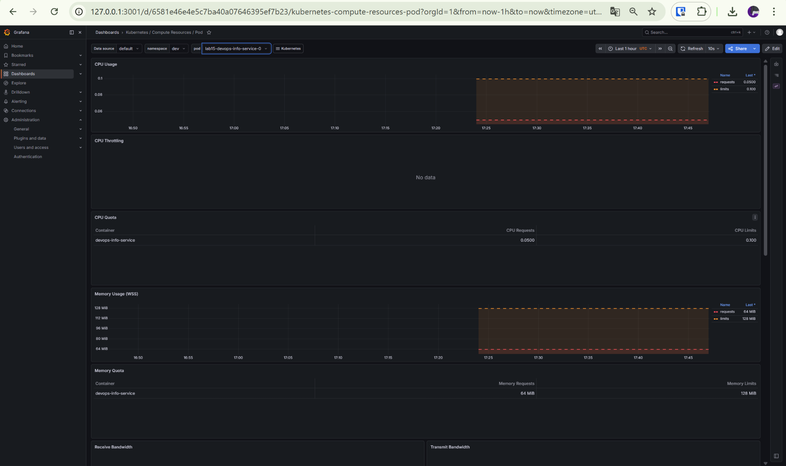
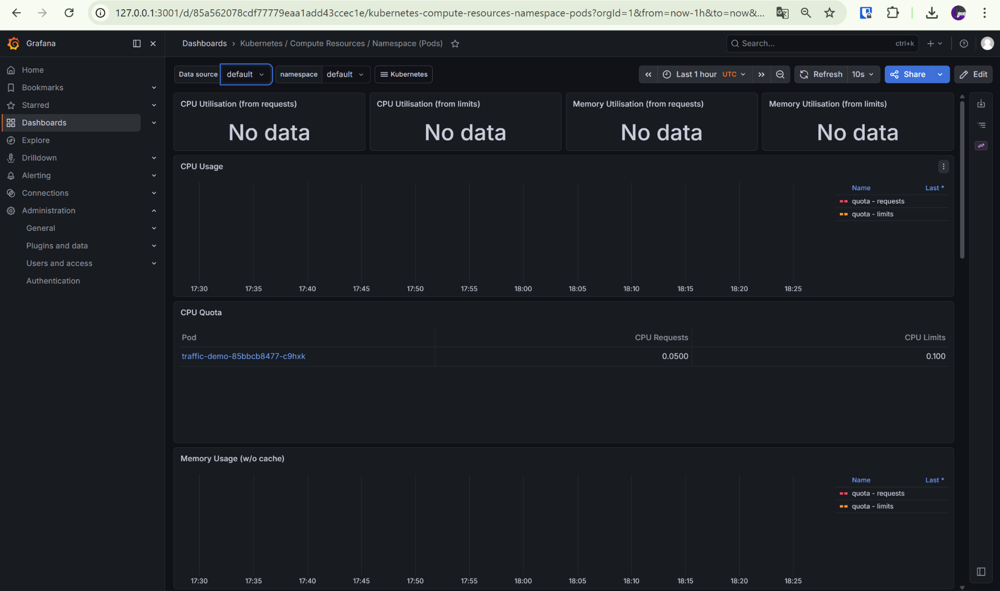
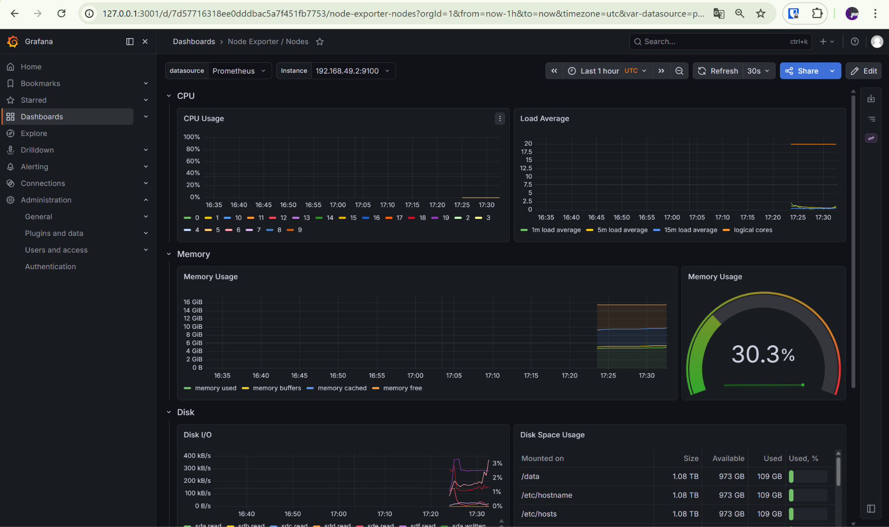
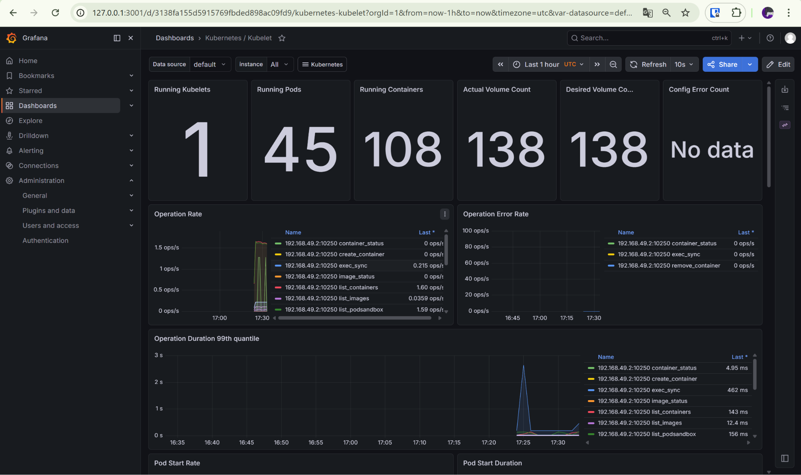
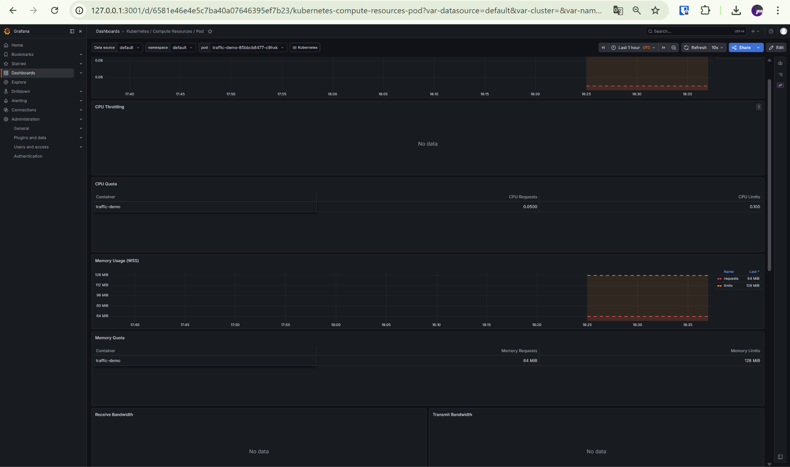
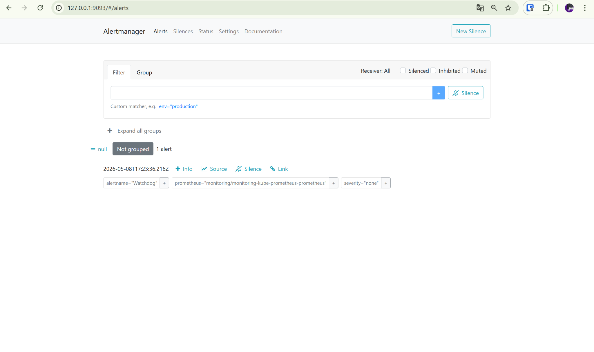

# Kubernetes Monitoring & Init Containers

## 1. Stack Components

### Prometheus Operator
Prometheus Operator manages the monitoring stack through Kubernetes custom resources. It reconciles Prometheus, Alertmanager, ServiceMonitor, PodMonitor, and related objects so the configuration stays declarative.

### Prometheus
Prometheus scrapes metrics endpoints, stores time-series data, and provides the query engine used by dashboards and alerting rules.

### Alertmanager
Alertmanager receives alerts from Prometheus, groups and deduplicates them, and exposes the active alert state in its web UI.

### Grafana
Grafana is the visualization layer of the stack. It uses Prometheus as a data source and provides dashboards for pods, namespaces, nodes, kubelet internals, and alerts.

### kube-state-metrics
kube-state-metrics exposes Kubernetes object state such as pods, StatefulSets, PVCs, deployments, and nodes.

### node-exporter
node-exporter exposes host-level metrics from the Kubernetes node, including CPU, memory, filesystem, and network statistics.

---

## 2. Installation Evidence

### Helm installation

```bash
helm repo add prometheus-community https://prometheus-community.github.io/helm-charts
helm repo update
helm upgrade --install monitoring prometheus-community/kube-prometheus-stack --namespace monitoring --create-namespace -f ./k8s/monitoring/values.yaml
```

### Verification

```bash
kubectl get po,svc -n monitoring
NAME                                                     READY   STATUS    RESTARTS      AGE
pod/alertmanager-monitoring-kube-prometheus-alertmanager-0   2/2   Running   2 (86s ago)   2d14h
pod/monitoring-grafana-777595984c-8zfk4                      3/3   Running   3 (94s ago)   2d14h
pod/monitoring-kube-prometheus-operator-54f68d65b4-9j4px     1/1   Running   1 (80s ago)   2d14h
pod/monitoring-kube-state-metrics-5957bd45bc-47zrk           1/1   Running   1 (80s ago)   2d14h
pod/monitoring-prometheus-node-exporter-h8n62                1/1   Running   1 (80s ago)   2d14h
pod/prometheus-monitoring-kube-prometheus-prometheus-0       2/2   Running   2 (95s ago)   2d14h

NAME                                      TYPE        CLUSTER-IP       EXTERNAL-IP   PORT(S)                      AGE
service/alertmanager-operated             ClusterIP   None             <none>        9093/TCP,9094/TCP,9094/UDP   2d14h
service/monitoring-grafana                ClusterIP   10.109.86.73     <none>        80/TCP                       2d14h
service/monitoring-kube-prometheus-alertmanager   ClusterIP   10.96.207.158    <none>   9093/TCP,8080/TCP   2d14h
service/monitoring-kube-prometheus-operator       ClusterIP   10.108.249.248   <none>   443/TCP             2d14h
service/monitoring-kube-prometheus-prometheus     ClusterIP   10.106.216.232   <none>   9090/TCP,8080/TCP   2d14h
service/monitoring-kube-state-metrics             ClusterIP   10.106.107.219   <none>   8080/TCP            2d14h
service/monitoring-prometheus-node-exporter       ClusterIP   10.110.85.180    <none>   9100/TCP            2d14h
service/prometheus-operated                       ClusterIP   None             <none>   9090/TCP            2d14h
```

---

## 3. Dashboard Answers

### 3.1 Pod Resources: StatefulSet
Dashboard: **Kubernetes / Compute Resources / Pod**

Observed pod:
- namespace: `dev`
- pod: `lab15-devops-info-service-0`

Observed values:
- CPU request: **0.0500 cores**
- CPU limit: **0.100 cores**
- Memory request: **64 MiB**
- Memory limit: **128 MiB**



### 3.2 Namespace Analysis: default namespace
Dashboard: **Kubernetes / Compute Resources / Namespace (Pods)**

At the time of observation, the active demo workload visible in the `default` namespace dashboard was `traffic-demo-85bbcb8477-c9hxk`. In that recorded state it was both the highest and the lowest CPU consumer among the active demo pods shown for the namespace, because it was the only active workload listed in the quota section.



### 3.3 Node Metrics
Dashboard: **Node Exporter / Nodes**

Observed values:
- Memory usage: **30.3%**
- Approximate memory usage: **about 5 GiB used**
- Logical CPU cores: **20**



### 3.4 Kubelet
Dashboard: **Kubernetes / Kubelet**

Observed values:
- Running kubelets: **1**
- Running pods: **45**
- Running containers: **108**



### 3.5 Network: default namespace
Dashboard: **Kubernetes / Compute Resources / Pod**

A demo pod in the `default` namespace was opened in Grafana to inspect live activity:
- namespace: `default`
- pod: `traffic-demo-85bbcb8477-c9hxk`

During the recorded interval, the dashboard showed CPU and memory request/limit series for the pod. No separate non-zero network traffic series were visible in the captured window.



### 3.6 Alerts
UI: **Alertmanager**

Observed values:
- Active alerts: **1**
- Visible alert: **Watchdog**



---

## 4. Init Containers

### 4.1 Download file pattern
Manifest: `k8s/init-containers/download-demo.yaml`

The init container downloads `https://example.com` with `wget` into a shared `emptyDir` volume. The main container mounts the same volume at `/data` and reads the downloaded file.

Verification:

```bash
kubectl apply -f ./k8s/init-containers/download-demo.yaml
kubectl get pods -w
kubectl logs init-download-demo -c init-download
kubectl exec init-download-demo -- cat /data/index.html
```

Observed output:

```bash
kubectl logs init-download-demo -c init-download
Connecting to example.com (104.20.23.154:443)
wget: note: TLS certificate validation not implemented
saving to '/work-dir/index.html'
index.html           100% |********************************|   528  0:00:00 ETA
'/work-dir/index.html' saved
Download complete
```

### 4.2 Wait-for-service pattern
Manifest: `k8s/init-containers/wait-for-service-demo.yaml`

The init container waits until `monitoring-grafana.monitoring.svc.cluster.local` becomes resolvable. Only after that does the main container start.

Verification:

```bash
kubectl apply -f ./k8s/init-containers/wait-for-service-demo.yaml
kubectl get pods -w
kubectl logs wait-for-service-demo -c wait-for-grafana
kubectl logs wait-for-service-demo -c main-app
```

Observed output:

```bash
kubectl logs wait-for-service-demo -c wait-for-grafana
Server:         10.96.0.10
Address:        10.96.0.10:53

Name:   monitoring-grafana.monitoring.svc.cluster.local
Address: 10.109.86.73

Dependency is ready
```

```bash
kubectl logs wait-for-service-demo -c main-app
Main container started after dependency check
```

---

## 5. Result

This lab demonstrates:
- successful installation of the Kube-Prometheus monitoring stack in the `monitoring` namespace;
- Grafana and Alertmanager access through `kubectl port-forward`;
- dashboard-based inspection of pod, namespace, node, kubelet, and alert data;
- one active alert visible in Alertmanager;
- two working init container patterns:
  - downloading data before the main container starts;
  - waiting for a service dependency before startup.

The bonus task with custom metrics and `ServiceMonitor` was not implemented.
