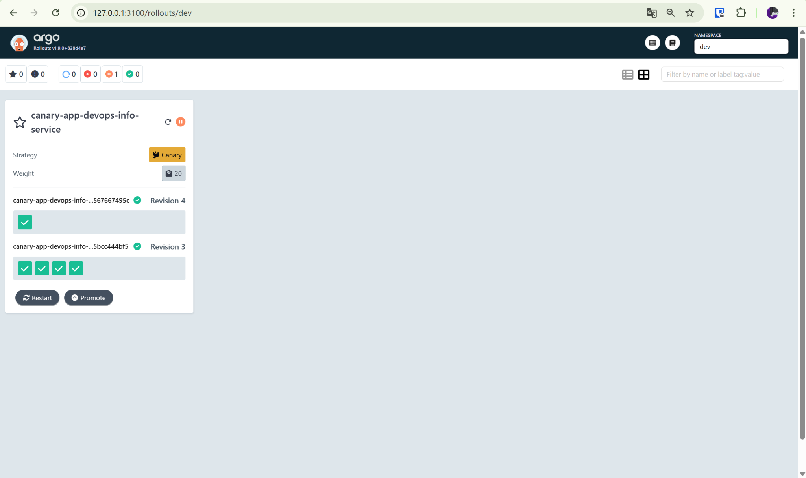
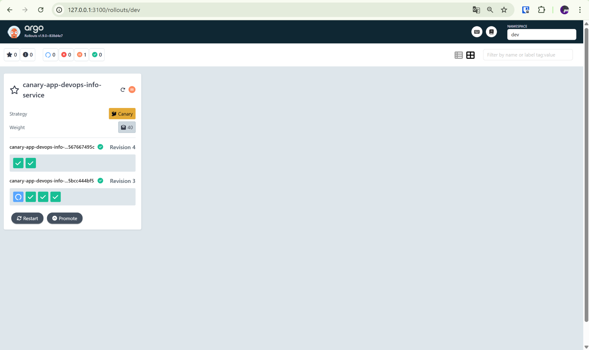
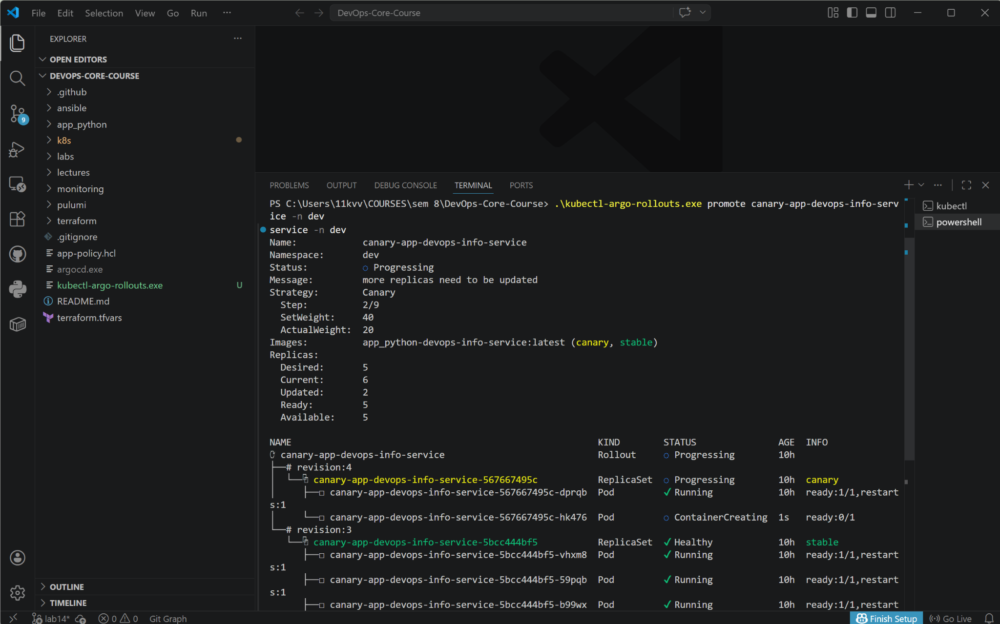
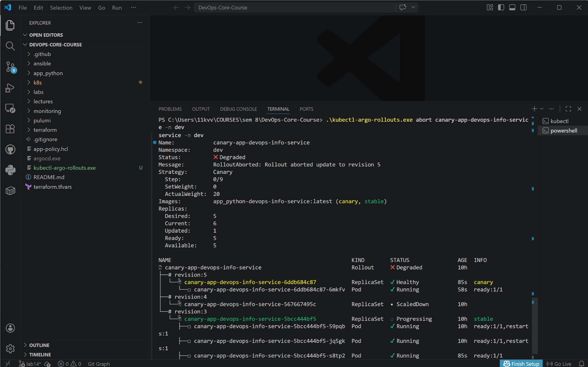
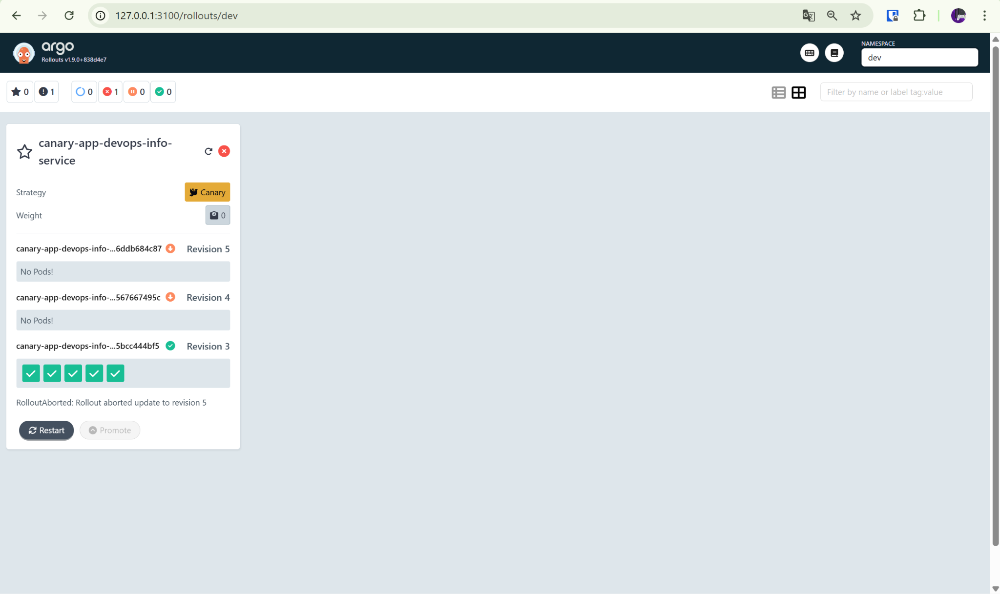
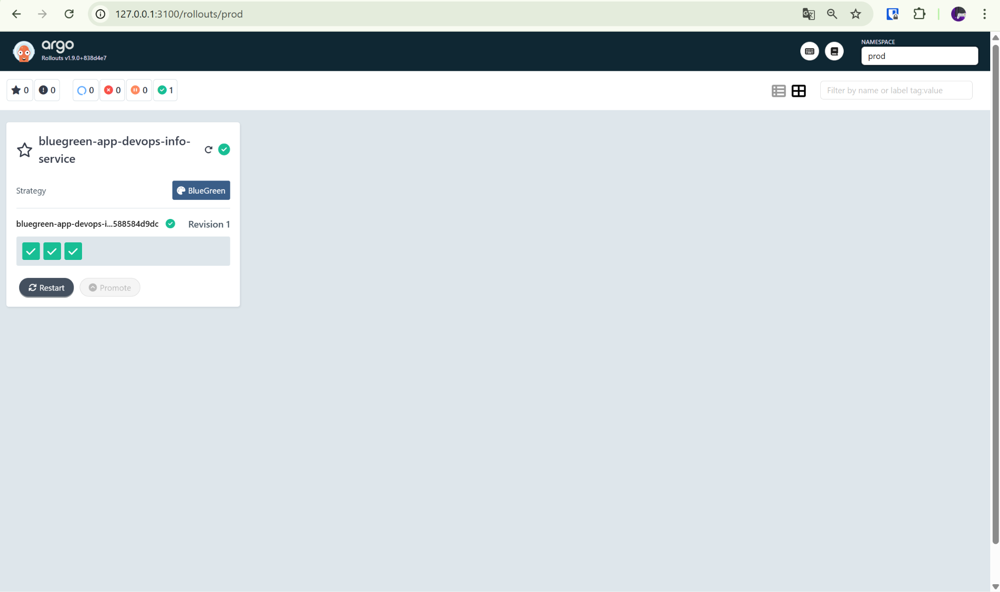
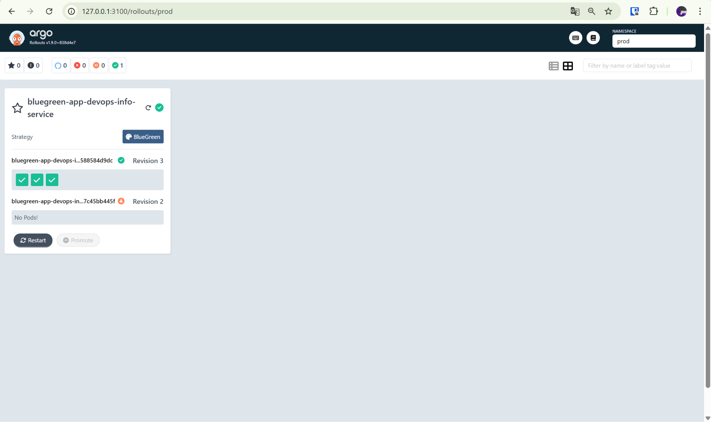

# Progressive Delivery with Argo Rollouts

## 1. Argo Rollouts Setup

Argo Rollouts controller and dashboard were installed into the `argo-rollouts` namespace, and the dashboard was accessed through:

```bash
kubectl port-forward svc/argo-rollouts-dashboard -n argo-rollouts 3100:3100
```

The Helm chart was updated to use **Rollout** resources instead of **Deployment** resources.

### Rollout vs Deployment

`Rollout` keeps the same pod template structure as `Deployment`, but adds progressive delivery capabilities:

- `strategy.canary` for gradual traffic shifting
- `strategy.blueGreen` for active/preview cutover
- manual promotion, abort, retry, undo
- richer rollout status in CLI and dashboard

---

## 2. Canary Deployment

The canary strategy was implemented in `templates/rollout.yaml` for the dev environment.

### Canary strategy

```yaml
strategy:
  canary:
    maxSurge: "1"
    maxUnavailable: 0
    steps:
      - setWeight: 20
      - pause: {}
      - setWeight: 40
      - pause:
          duration: 30s
      - setWeight: 60
      - pause:
          duration: 30s
      - setWeight: 80
      - pause:
          duration: 30s
      - setWeight: 100
```

This configuration pauses the rollout at 20% for manual approval and then continues through timed pauses until full promotion.

### Observing rollout steps

The first rollout pause is visible at 20% traffic weight.



After manual promotion, the rollout advanced to the next step and reached 40%.



### Promotion

Manual promotion was tested with:

```bash
.\kubectl-argo-rollouts.exe promote canary-app-devops-info-service -n dev
```

The CLI output shows the rollout moving to step `2/9` with `SetWeight: 40` and `ActualWeight: 20`.



### Abort / rollback

A later canary update was aborted to validate rollback behavior.

```bash
.\kubectl-argo-rollouts.exe abort canary-app-devops-info-service -n dev
```

The CLI output shows the rollout entering the degraded state with the message `RolloutAborted: Rollout aborted update to revision 5`.



The dashboard confirms the aborted rollout, failed status, and restored stable revision.



Result: canary provides controlled, step-by-step exposure and allows rollback before full release.

---

## 3. Blue-Green Deployment

The prod environment was configured with a blue-green strategy and a separate preview service.

### Blue-green strategy

```yaml
strategy:
  blueGreen:
    activeService: bluegreen-app-devops-info-service
    previewService: bluegreen-app-devops-info-service-preview
    autoPromotionEnabled: false
    scaleDownDelaySeconds: 30
```

### Active and preview services

- **Active service** served production traffic on port-forwarded `127.0.0.1:8080`
- **Preview service** exposed the new version on `127.0.0.1:8081`
- Before promotion:
  - active version returned `1.0.0-prod-lab14`
  - preview version returned `1.0.1-bg`

This allowed validation of the new release before switching production traffic.

### Blue-green dashboard state

The dashboard shows a healthy blue-green rollout in the `prod` namespace.



### Promotion and instant rollback

After preview validation, the new revision was promoted to active. Then `undo` was tested to switch traffic back to the previous stable revision.

The dashboard after rollback shows the old revision active/stable again.



Result: blue-green gives a very fast cutover and a very fast rollback, but requires duplicated capacity during deployment.

---

## 4. Strategy Comparison

| Strategy | Best use case | Advantages | Trade-offs |
|---|---|---|---|
| Canary | Risk-sensitive releases, gradual exposure, validation under real traffic | Fine-grained rollout control, safe staged release, easy abort before 100% | Slower rollout, more operational steps |
| Blue-Green | Fast cutover for production, simple preview testing, instant rollback | Clear active/preview separation, very fast promotion and rollback | Needs more resources during transition |

### Recommendation

- Use **canary** when release risk is higher and the change should be validated progressively.
- Use **blue-green** when a preview environment and near-instant rollback are more important than gradual traffic shifting.

---

## 5. CLI Commands Reference

```bash
kubectl get rollout -n dev
kubectl get rollout -n prod

.\kubectl-argo-rollouts.exe get rollout canary-app-devops-info-service -n dev
.\kubectl-argo-rollouts.exe get rollout canary-app-devops-info-service -n dev -w
.\kubectl-argo-rollouts.exe promote canary-app-devops-info-service -n dev
.\kubectl-argo-rollouts.exe abort canary-app-devops-info-service -n dev

.\kubectl-argo-rollouts.exe get rollout bluegreen-app-devops-info-service -n prod
.\kubectl-argo-rollouts.exe promote bluegreen-app-devops-info-service -n prod
.\kubectl-argo-rollouts.exe undo bluegreen-app-devops-info-service -n prod

kubectl port-forward svc/argo-rollouts-dashboard -n argo-rollouts 3100:3100
kubectl port-forward svc/bluegreen-app-devops-info-service -n prod 8080:80
kubectl port-forward svc/bluegreen-app-devops-info-service-preview -n prod 8081:80
```
