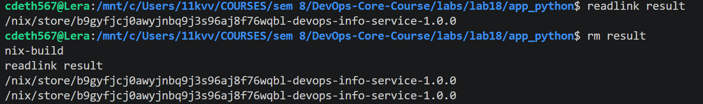
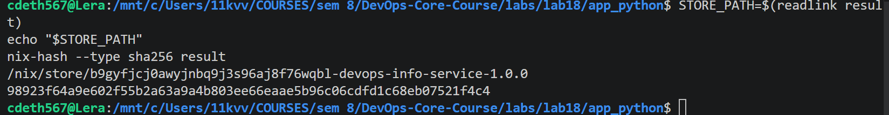
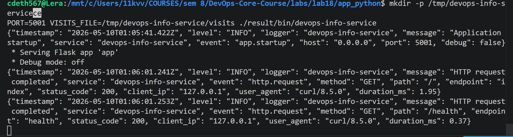
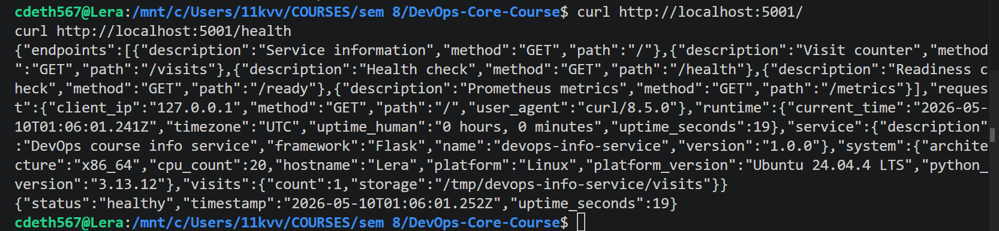
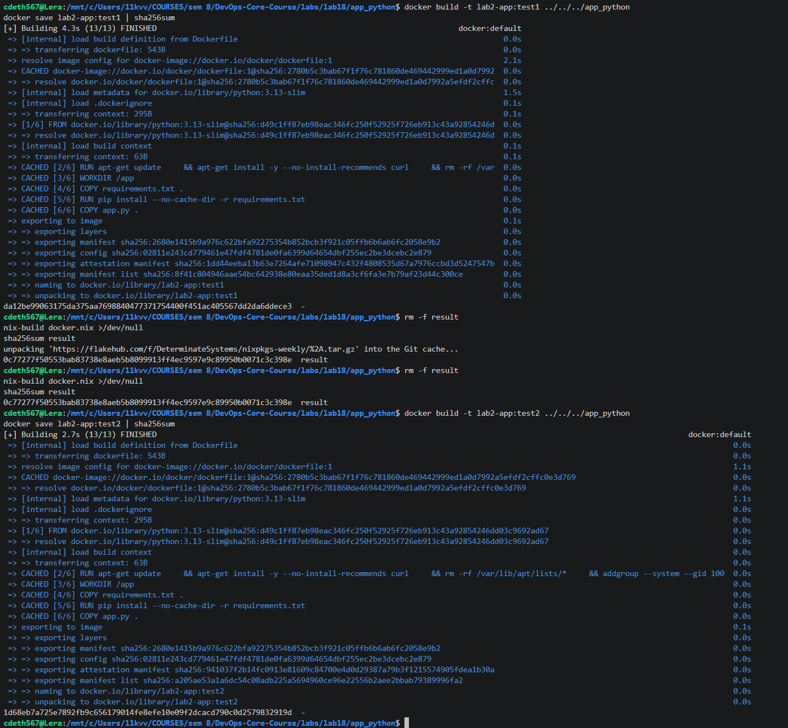
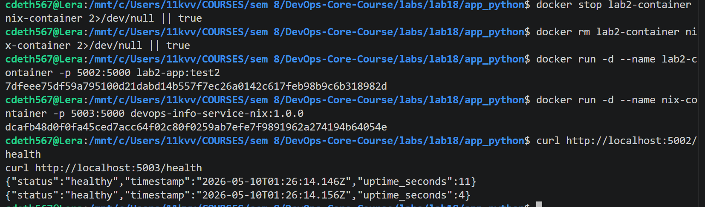
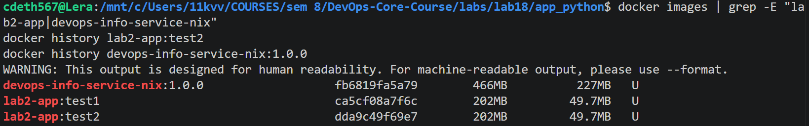

# Lab 18 — Reproducible Builds with Nix

## Completion Status

- **Task 1 — Build Reproducible Artifacts from Scratch:** completed
- **Task 2 — Reproducible Docker Images with Nix:** completed
- **Bonus Task — Modern Nix with Flakes:** not completed

---

## Task 1 — Build Reproducible Python App

### 1. Environment and Installation

The work was performed in **WSL2 (Ubuntu)** because Nix commands were not available in Windows PowerShell. Nix was installed with the Determinate Systems installer:

```bash
curl --proto '=https' --tlsv1.2 -sSf -L https://install.determinate.systems/nix | sh -s -- install
```

After installation, Nix commands worked successfully and the application was built with `nix-build`.

---

### 2. Python Application Derivation

The application was packaged with the following `default.nix`:

```nix
{ pkgs ? import <nixpkgs> {} }:

pkgs.python3Packages.buildPythonApplication rec {
  pname = "devops-info-service";
  version = "1.0.0";
  src = ./.;

  format = "other";
  doCheck = false;

  propagatedBuildInputs = with pkgs.python3Packages; [
    flask
    prometheus-client
  ];

  nativeBuildInputs = [ pkgs.makeWrapper ];

  installPhase = ''
    runHook preInstall

    mkdir -p $out/bin $out/share/${pname}
    cp app.py $out/share/${pname}/app.py

    makeWrapper ${pkgs.python3.interpreter} $out/bin/devops-info-service \
      --add-flags "$out/share/${pname}/app.py" \
      --prefix PYTHONPATH : "$PYTHONPATH" \
      --set PYTHONDONTWRITEBYTECODE 1 \
      --set PYTHONUNBUFFERED 1

    runHook postInstall
  '';

  meta = with pkgs.lib; {
    description = "DevOps course info service packaged reproducibly with Nix";
    mainProgram = "devops-info-service";
    license = licenses.mit;
    platforms = platforms.linux ++ platforms.darwin;
  };
}
```

### 3. Explanation of the Derivation

- `buildPythonApplication` creates a runnable Python application package.
- `src = ./.;` packages the local application directory.
- `format = "other"` is appropriate because the project does not use `setup.py` or `pyproject.toml`.
- `propagatedBuildInputs` declares runtime Python dependencies.
- `makeWrapper` generates the executable entrypoint.
- `installPhase` copies `app.py` into the Nix output and wraps it with the Nix-managed Python interpreter.

---

### 4. Reproducibility Proof

The following commands were executed:

```bash
readlink result
rm result
nix-build
readlink result
STORE_PATH=$(readlink result)
echo "$STORE_PATH"
nix-hash --type sha256 result
```

### 5. Real Outputs

**Store path before rebuild:**

```text
/nix/store/b9gyfjcj0awyjnbq9j3s96aj8f76wqbl-devops-info-service-1.0.0
```

**Store path after rebuild:**

```text
/nix/store/b9gyfjcj0awyjnbq9j3s96aj8f76wqbl-devops-info-service-1.0.0
```

**Hash of the Nix result:**

```text
98923f64a9e602f55b2a63a9a4b803ee66eaae5b96c06cdfd1c68eb07521f4c4
```

### 6. Interpretation

Repeated `nix-build` produced the **same `/nix/store/...` path** and the build result hash was recorded successfully. This demonstrates Nix content-addressable behavior:

- the output path encodes the build inputs;
- unchanged inputs produce the same output path;
- the resulting artifact can be verified by hashing the `result` symlink target.

---

### 7. Running the Nix-Built Application

The first attempt failed because the application tried to write runtime state into `/data`, which is not writable in a plain local WSL run. The working command was:

```bash
mkdir -p /tmp/devops-info-service
PORT=5001 VISITS_FILE=/tmp/devops-info-service/visits ./result/bin/devops-info-service
```

Then the service was tested with:

```bash
curl http://localhost:5001/
curl http://localhost:5001/health
```

### 8. Runtime Result

The application responded successfully:

- `/` returned the full service information payload;
- `/health` returned:

```json
{"status":"healthy","timestamp":"2026-05-10T01:04:23.983Z","uptime_seconds":10}
```

This confirmed that the Nix-built artifact is runnable and behaves correctly when a writable runtime data file is provided.

---

### 9. Comparison with Traditional `pip + venv`

Traditional Lab 1 workflow:

```bash
python -m venv venv
source venv/bin/activate
pip install -r requirements.txt
python app.py
```

Why `requirements.txt` provides weaker guarantees than Nix:

- it depends on the Python interpreter already installed on the machine;
- installation happens at runtime, not as a pure build;
- transitive dependencies may drift over time;
- the final environment is mutable and not content-addressed.

Why Nix is stronger:

- Python and dependencies are selected from the pinned Nix package set;
- the build is described declaratively;
- outputs live in `/nix/store/<hash>-<name>-<version>`;
- the same derivation produces the same result as long as the inputs do not change.

### 10. Comparison Table — Lab 1 vs Lab 18

| Aspect | Lab 1 (`pip` + `venv`) | Lab 18 (Nix derivation) |
|---|---|---|
| Python version | depends on local machine | controlled by Nix |
| Dependency resolution | install-time | build-time |
| Environment mutability | mutable | immutable output |
| Reproducibility | approximate | strong/content-addressed |
| Output path | ordinary filesystem path | `/nix/store/<hash>-...` |
| Binary cache support | no | yes |

### 11. Reflection

If Nix had been used in Lab 1 from the start, the application environment would have been easier to reproduce across machines and CI pipelines. Instead of re-creating virtual environments manually, the same derivation could always produce the same packaged application artifact.

---

## Task 2 — Reproducible Docker Images with Nix

### 1. Nix Docker Image Definition

The Docker image was built with this `docker.nix`:

```nix
{ pkgs ? import <nixpkgs> {} }:

let
  app = import ./default.nix { inherit pkgs; };
in
pkgs.dockerTools.buildLayeredImage {
  name = "devops-info-service-nix";
  tag = "1.0.0";
  created = "1970-01-01T00:00:01Z";

  contents = [ app ];

  config = {
    Cmd = [ "${app}/bin/devops-info-service" ];
    Env = [
      "HOST=0.0.0.0"
      "PORT=5000"
      "PYTHONDONTWRITEBYTECODE=1"
      "PYTHONUNBUFFERED=1"
    ];
    ExposedPorts = {
      "5000/tcp" = {};
    };
    WorkingDir = "/";
  };
}
```

### 2. Explanation of `docker.nix`

- `buildLayeredImage` builds a Docker-compatible image from Nix store content.
- `name` and `tag` define the final image tag.
- `created = "1970-01-01T00:00:01Z"` makes the image timestamp deterministic.
- `contents = [ app ]` includes the Nix-built application closure in the image.
- `config.Cmd` points directly to the Nix-built executable.
- `config.Env` sets runtime environment variables.
- `ExposedPorts` exposes port `5000/tcp`.

---

### 3. Building and Loading the Nix Docker Image

Commands used:

```bash
nix-build docker.nix
docker load < result
```

The image loaded successfully as:

```text
Loaded image: devops-info-service-nix:1.0.0
```

---

### 4. Reproducibility Comparison — Nix vs Traditional Dockerfile

Commands used:

```bash
docker build -t lab2-app:test1 ../../../app_python
docker save lab2-app:test1 | sha256sum

rm result
nix-build docker.nix
sha256sum result

rm result
nix-build docker.nix
sha256sum result

docker build -t lab2-app:test2 ../../../app_python
docker save lab2-app:test2 | sha256sum
```

### 5. Real Hash Outputs

**Traditional Dockerfile build #1:**

```text
43a5d36c0e7dff946cf686dd267cef2070c4c05a5df2ea317c3b06dc291186fa
```

**Nix Docker image build #1:**

```text
0c77277f50553bab83738e8aeb5b8099913ff4ec9597e9c89950b0071c3c398e
```

**Nix Docker image build #2:**

```text
0c77277f50553bab83738e8aeb5b8099913ff4ec9597e9c89950b0071c3c398e
```

**Traditional Dockerfile build #2:**

```text
068c35721d520a7a1a188d54440560291667054df99e066ec1311397649f32d2
```

### 6. Interpretation

The **Nix Docker image hash was identical across two builds**, while the **traditional Docker image hash changed** between `test1` and `test2` even though the source did not change.

This is the core result of Task 2:

- **Nix image:** reproducible
- **Traditional Dockerfile image:** not bit-for-bit reproducible

---

### 7. Side-by-Side Container Test

Commands used:

```bash
docker stop lab2-container nix-container 2>/dev/null || true
docker rm lab2-container nix-container 2>/dev/null || true

docker run -d --name lab2-container -p 5002:5000 lab2-app:test2
docker run -d --name nix-container -p 5003:5000 devops-info-service-nix:1.0.0

curl http://localhost:5002/health
curl http://localhost:5003/health
```

### 8. Real Outputs

**Traditional Docker container:**

```json
{"status":"healthy","timestamp":"2026-05-10T01:26:14.146Z","uptime_seconds":11}
```

**Nix-built container:**

```json
{"status":"healthy","timestamp":"2026-05-10T01:26:14.156Z","uptime_seconds":4}
```

Both containers ran successfully side by side.

---

### 9. Image Size Comparison

Command used:

```bash
docker images | grep -E "lab2-app|devops-info-service-nix"
```

Observed output:

- `devops-info-service-nix:1.0.0` — **466MB**
- `lab2-app:test1` — **202MB**
- `lab2-app:test2` — **202MB**

### 10. Size Comparison Table

| Metric | Traditional Dockerfile | Nix dockerTools |
|---|---|---|
| Image tag used for comparison | `lab2-app:test2` | `devops-info-service-nix:1.0.0` |
| Reported image size on this machine | 202MB | 466MB |
| Reproducibility | no | yes |
| Base image dependency | yes (`python:3.13-slim`) | no external base image |
| Build model | imperative Docker layers | declarative Nix closure |

### 11. Size Analysis

In this environment, the Nix image was **larger** than the traditional Docker image. That does **not** contradict the goal of the lab. The purpose of Task 2 is to prove reproducibility, not necessarily to minimize size. The larger size is explained by the full Nix runtime closure being embedded directly into the image, while the traditional Dockerfile relies on a prebuilt slim base image.

---

### 12. `docker history` Comparison

Commands used:

```bash
docker history lab2-app:test2
docker history devops-info-service-nix:1.0.0
```

### 13. Observations from `docker history`

**Traditional Docker image:**

- shows normal Dockerfile steps such as `COPY`, `RUN pip install`, `WORKDIR`, and base image layers;
- includes human-time-based entries such as `7 minutes ago` and `29 hours ago` in the `CREATED` column;
- depends on a mutable base image (`python:3.13-slim`).

**Nix Docker image:**

- shows layers derived from concrete `/nix/store/...` paths;
- `CREATED` is shown as `N/A` rather than wall-clock build timestamps;
- each layer corresponds to immutable Nix store content.

This demonstrates that the Nix image is built from content-addressed derivations, while the traditional Docker image reflects ordinary build-time metadata and mutable upstream layers.

---

### 14. Why Traditional Dockerfiles Cannot Achieve Bit-for-Bit Reproducibility

Traditional Dockerfiles are weaker because:

- they depend on mutable base image tags such as `python:3.13-slim`;
- `apt-get` and `pip install` fetch content at build time;
- build metadata and timestamps vary between builds;
- manifest/attestation details can differ even when the source does not change.

Nix avoids these issues because the image is constructed from exact derivations and a deterministic timestamp.

---

### 15. Reflection — If Lab 2 Were Rebuilt with Nix

If Lab 2 were redone with Nix from the beginning, I would still keep Docker for running containers locally, but I would build the image with `dockerTools` instead of relying on a handwritten Dockerfile. That would provide deterministic rebuilds, easier auditing of dependencies, and more confidence in rollbacks and CI/CD reproducibility.

Practical scenarios where this matters:

- CI/CD pipelines that must reproduce the same artifact later;
- security audits that require exact dependency traceability;
- rollbacks where the previous image must be guaranteed identical;
- team environments where “works on my machine” differences must be eliminated.

---

## Bonus Task — Flakes

A `flake.nix` starter file exists in `labs/lab18/app_python/`, but the bonus task was **not completed**.

The following were **not** completed:

```bash
nix flake update
nix build
nix build .#dockerImage
nix develop
```

No `flake.lock` was generated, so the bonus is intentionally left incomplete.

---

## Screenshots

### Task 1









### Task 2







---

## Final Conclusion

Task 1 and Task 2 were completed successfully:

- the Python application was built reproducibly with Nix;
- the same Nix inputs produced the same store path and identical artifact hash;
- a Docker image was built reproducibly with `dockerTools`;
- repeated Nix Docker builds produced identical hashes;
- repeated traditional Docker builds produced different hashes;
- both the traditional container and the Nix-built container ran successfully.

The bonus task with flakes was not completed.
